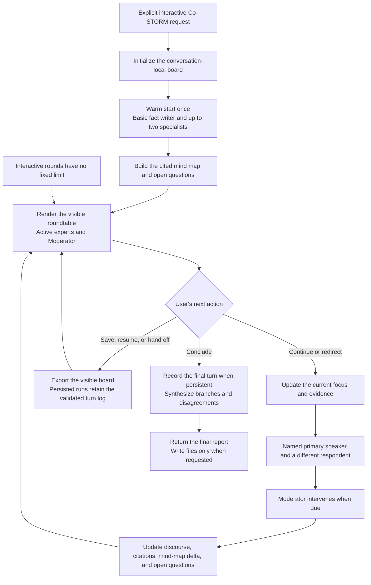

# STORM Research Skill

[](https://github.com/lizhouai/storm-research-skill/releases/latest)
[](LICENSE)

An Agent Skill for STORM-style deep research: perspective-guided interviews, source-grounded synthesis, structured outlines, inline citations, and verification notes.

This skill packages the Stanford STORM research pattern as a reusable workflow for coding agents that support `SKILL.md`-based Agent Skills. It is based on the original [stanford-oval/storm](https://github.com/stanford-oval/storm) project.

## What It Does

Use `storm` when you want an agent to produce standard STORM research artifacts instead of a shallow summary.

It helps the agent:

- define the research scope, audience, assumptions, and source boundaries
- generate multiple writer perspectives, including a basic fact writer
- run search-backed simulated interviews from each perspective
- collect evidence into an information table
- refine an outline from the gathered evidence
- write section-by-section with inline citations
- produce the standard STORM artifact bundle
- verify citation coverage, unsupported claims, source gaps, and stale-source risks

The default mode is classic STORM. A prompt-native Co-STORM preview is available for interactive exploration, roundtable discussion, user steering, and mind-map driven research. It is an agent workflow, not a bundled `knowledge-storm` runner.

## See It in Action

One Classic STORM prompt progresses through a topic-only outline, an evidence-refined outline, a cited draft, and a polished article with references and verification notes.

<a href="https://lizhouai.github.io/storm-research-skill/examples/classic-rag-evaluation/storm_gen_article_polished.html">
  
</a>

| Mode | What remains visible | Example |
|---|---|---|
| Classic STORM | Four stable research artifacts, primary sources, and verification notes | [Explore the complete RAG evaluation bundle](examples/classic-rag-evaluation/README.md) |
| Prompt-native Co-STORM preview | Simulated participant handoffs, cited mind-map updates, open questions, and user steering | [Read the compact RAG evaluation roundtable](examples/co-storm-rag-evaluation/README.md) · [Open the end-to-end RAG technology report](https://lizhouai.github.io/storm-research-skill/examples/co-storm-rag-technology/rag-technology-research-report.html) |

These examples are source-grounded output snapshots, not benchmark claims. The Co-STORM example remains a prompt-native preview and does not claim to run the upstream `CoStormRunner`.

## Install

Install with:

```bash
npx skills add lizhouai/storm-research-skill
```

This installs the skill for the current project. Add `-g` only when you intentionally want a global installation, and use the same scope when updating.

## Usage

Ask your agent to use the `storm` skill. In Codex, you can call it explicitly:

```text
$storm Research the current state of AI code review tools.
```

By default this creates the standard HTML artifact bundle under `.results/<topic-slug>/`. The guarded Classic publication path currently validates HTML only; for another format, use chat-only output and accept the reduced mechanical enforcement boundary. See [Output Format](#output-format).

General agent prompt:

```text
Use the storm skill to write a source-grounded background review of open-source LLM evaluation frameworks.
```

Prompt-native Co-STORM preview:

```text
Use the prompt-native Co-STORM preview to explore commercial paths for embodied AI. Start with a roundtable and maintain a mind-map style structure.
```

In the Co-STORM preview, the agent keeps a conversation-local board with a cited mind map, discourse history, participants, open questions, sources, unused evidence, and current focus. The simulated participants are visible in the response: the warm start gives each active expert a labeled contribution and a moderator handoff, while later turns show a named primary speaker plus a distinct respondent and periodic moderator intervention. Choice-first steering keeps the user in control. When persistence is explicitly requested, the guarded state CLI records schema-checked turns in an atomic hash-linked log; ordinary conversation mode remains prompt-only. If state or citation mappings are lost, the agent must disclose the gap and rebuild them before continuing.

### Ending a Co-STORM Roundtable

No special command or fixed round count is required. Any clear instruction to
conclude the discussion triggers the final-report path. For an in-chat report,
say:

```text
Conclude the Co-STORM roundtable now. Synthesize the current mind map, cited evidence, disagreements, uncertainties, and open questions into the final report.
```

To save the result as files, include the format and destination explicitly:

```text
Conclude the Co-STORM roundtable and save the cited mind map and final report as Markdown under .results/embodied-ai/.
```

Without an explicit file request, the final report remains in the conversation.
With one, the skill writes the requested one or both Co-STORM artifacts described
in [Output Format](#output-format).

Local-document constrained research:

```text
Use storm to synthesize the documents in this repository. Restrict retrieval to the provided material unless web research is explicitly needed.
```

## Output Format

Guarded Classic research produces this standard HTML artifact bundle under `.results/<topic-slug>/`:

- `direct_gen_outline.html`: topic-only outline before evidence refinement
- `storm_gen_outline.html`: evidence-refined outline
- `storm_gen_article.html`: cited draft article
- `storm_gen_article_polished.html`: polished final article with references and verification notes

If you explicitly ask for chat-only or no files, the skill can instead return a compact in-chat brief with perspectives, query log, citations, references, and verification notes.

The guarded Classic artifact validator does not accept non-HTML files. Do not
claim guarded completion for another Classic file format.

The Co-STORM preview is conversation-first and never creates the four Classic
STORM files. Without an explicit file request, its final report remains in the
conversation. For file output, it writes only the requested Co-STORM artifacts:

- `co_storm_mind_map.<format>`: the cited mind map and open questions
- `co_storm_report.<format>`: the final report synthesized from the mind map

Ask for a complete Co-STORM file bundle to receive both. If the request names
neither a format nor a destination, file output defaults to HTML under
`.results/<topic-slug>/`.

## When To Use It

Good fit:

- research reports
- background reviews
- literature reviews
- competitive or market scans
- technical landscape summaries
- source-grounded policy or historical synthesis
- multi-perspective explanations of contested topics

Less useful for:

- quick factual lookups
- tasks where no citations are needed
- implementation work that mainly needs code changes
- unsupported speculation or opinion writing

## Workflow

Classic STORM follows this sequence:

1. Frame the topic and deliverable.
2. Generate writer perspectives.
3. Run simulated interviews for each perspective.
4. Build an information table from gathered evidence.
5. Draft and refine the outline.
6. Write the standard artifact bundle.
7. Polish, reorder citations, verify claims, and check artifact encoding.

File-producing Classic and Local Runner requests default to the bundled guarded
runtime when Python is available. A versioned `.storm-run/run.json` and event
log define the only next action; zero-dependency scripts enforce state
transitions, artifact structure, hashes, and citation mappings before the run
can reach `COMPLETE`. Phase outputs remain under `.storm-run/staging`, so the
four public files stay absent before validation. The final transition atomically replaces the validated
artifact bytes and records their hashes in `.storm-run/publication.json`;
completed runs revalidate that receipt. Prompt-only fallback remains available when Python is
unavailable or the user explicitly requests chat-only output, with the reduced
enforcement boundary stated in the response.

The prompt-native Co-STORM preview is used only when you explicitly ask for interactive exploration, roundtable discussion, user steering, or a mind map. It starts with a mini STORM warm start, renders role-attributed simulated discussion instead of hiding participants in internal state, maintains a cited mind map during the conversation, and returns the final report in chat or writes only requested artifacts when you ask to conclude. The Co-STORM reference describes the portable prompt protocol, but this repository does not bundle DSPy modules, independently running expert agents, or an executable Co-STORM runner.

For persistent Co-STORM runs, `record-turn` validates turn order, stable
participant identities, retrieval/source mappings, citations, mind-map delta
shape, final-report intent, and a hash-linked turn log before outer lifecycle
transitions. The bundled Classic artifact validator does not mechanically
verify Co-STORM mind-map or report contents; the agent must still review their
source and citation support before claiming completion.

### Co-STORM Interaction Flow



The warm start happens once. After that, the roundtable remains in the
interactive loop until the user asks to conclude; continuing, redirecting, or
checkpointing does not consume a predefined number of rounds.

## Repository Structure

```text
storm-research-skill/
  README.md
  LICENSE
  CONTRIBUTING.md
  assets/
    social-preview.png
  evals/
    baseline-results.json
    cases.json
  examples/
    README.md
    classic-rag-evaluation/
    co-storm-rag-evaluation/
    co-storm-rag-technology/
  scripts/
    run_forward_evals.py
    validate_skill.py
  tests/
  skills/
    storm/
      SKILL.md
      agents/
        openai.yaml
      references/
        artifact-contract.md
        classic-storm.md
        co-storm.md
        co-storm-turn.schema.json
        local-runner.md
        run-state.schema.json
        safety-contract.md
        storm-method.md
      scripts/
        audit_citations.py
        storm_state.py
        validate_artifacts.py
```

- `skills/storm/SKILL.md` is the skill entry point and activation contract.
- `skills/storm/references/` contains mode-specific workflows and contracts; `storm-method.md` remains a compatibility index.
- `skills/storm/agents/openai.yaml` provides display metadata for OpenAI-style agent surfaces.
- `assets/social-preview.png` is the upload-ready repository social preview; the `Fact Researcher` label is visual shorthand for the canonical Basic fact writer role.
- `examples/` contains a complete Classic artifact bundle, a compact prompt-native Co-STORM interaction, and an end-to-end Co-STORM report run.
- `evals/baseline-results.json` preserves the historical pre-runtime B0 behavior snapshot; it is not the current executable-canary result.
- `evals/cases.json` defines executable forward-eval cases and objective oracle assertions for critical modes and safety boundaries.
- `scripts/run_forward_evals.py` runs isolated offline contract canaries and can invoke an explicitly configured real-Agent command without making that nondeterministic path a release gate.
- `scripts/validate_skill.py` enforces the repository contract without third-party Python dependencies.
- The repository root intentionally does not contain `SKILL.md`; the standard `skills/storm/` layout lets the skills CLI install the whole bundle.

## Compatibility

This repository uses the Agent Skills `SKILL.md` format. Local discovery and bundle installation are validated with the `npx skills` CLI. Other compatible agents can read the same skill, but tool availability, native choice UI, and automatic triggering vary by host.

Different agents expose skills differently. If explicit invocation syntax is unavailable, ask the agent in natural language to "use the storm skill".

## Updating

Update a project-local installation with:

```bash
npx skills update storm
```

For a global installation, use the matching global scope:

```bash
npx skills update storm -g
```

## Development

Clone the repository:

```bash
git clone https://github.com/lizhouai/storm-research-skill.git
cd storm-research-skill
```

Run the repository checks and validate local discovery:

```bash
python scripts/validate_skill.py
python -m unittest discover -s tests -p "test_*.py"
python scripts/run_forward_evals.py --repetitions 10 --output .results/forward-evals --replace
npx -y skills@1.5.15 add . --list
npx -y skills@1.5.15 use . --skill storm
git diff --check
empty_tree="$(git hash-object -t tree /dev/null)"
git diff --check "$empty_tree" HEAD
```

Install your local working copy while developing:

```bash
npx skills add . -g --copy
```

## License

MIT License. See [LICENSE](LICENSE).

The original [stanford-oval/storm](https://github.com/stanford-oval/storm) project is also released under the MIT License. See the original [STORM paper](https://aclanthology.org/2024.naacl-long.347/) and [Co-STORM paper](https://aclanthology.org/2024.emnlp-main.554/) for the research systems this prompt-native skill adapts.
