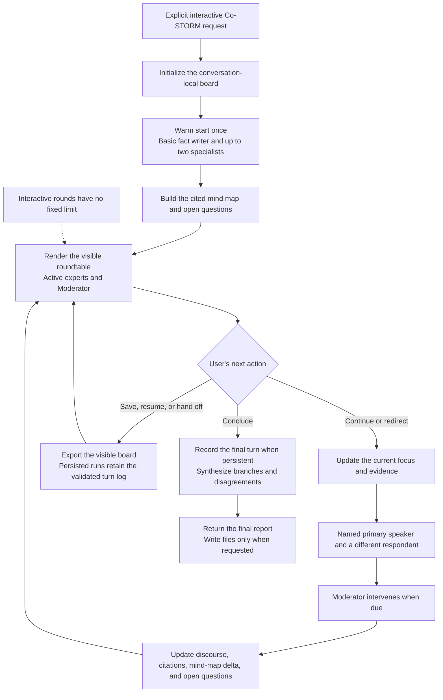

# STORM Research Skill

[](https://github.com/lizhouai/storm-research-skill/releases/latest)
[](LICENSE)

An Agent Skill for STORM-style deep research: perspective-guided interviews, source-grounded synthesis, structured outlines, inline citations, and verification notes.

This skill packages the Stanford STORM research pattern as a reusable workflow for coding agents that support `SKILL.md`-based Agent Skills. It is based on the original [stanford-oval/storm](https://github.com/stanford-oval/storm) project.

## Why It Stands Out

Use `storm` when you need a traceable research workflow rather than a shallow
one-shot summary.

| Highlight | What it provides |
|---|---|
| Perspective-guided depth | A basic fact writer, focused viewpoints, simulated interviews, and an evidence-refined outline |
| Auditable evidence chain | Source IDs, query and evidence records, inline citations, reference checks, and visible evidence gaps |
| Guarded and recoverable | Versioned state, one enforced next action, staging, artifact hashes, and retry-safe publication for file-producing runs |
| Interactive exploration | A prompt-native Co-STORM preview with visible simulated participants, a cited mind map, and free-form steering |
| Portable core | A standard Agent Skill layout and bundled runtime scripts with no third-party Python dependency |
| Flexible evidence paths | Experimental Agent-ranked and local lexical retrieval, plus official Classic output import |

Classic STORM is the default. The Co-STORM experience is an Agent workflow, not
a bundled `knowledge-storm` runner.

## See It in Action

One Classic STORM prompt progresses through a topic-only outline, an evidence-refined outline, a cited draft, and a polished article with references and verification notes.

<a href="https://lizhouai.github.io/storm-research-skill/examples/classic-rag-evaluation/storm_gen_article_polished.html">
  
</a>

| Mode | What remains visible | Example |
|---|---|---|
| Classic STORM | Four stable research artifacts, source-grounded evidence, and verification notes | [Explore the complete RAG evaluation bundle](examples/classic-rag-evaluation/README.md) |
| Prompt-native Co-STORM preview | Simulated participant handoffs, cited mind-map updates, open questions, and user steering | [Read the compact RAG evaluation roundtable](examples/co-storm-rag-evaluation/README.md) · [Open the end-to-end RAG technology report](https://lizhouai.github.io/storm-research-skill/examples/co-storm-rag-technology/rag-technology-research-report.html) |

These examples are source-grounded output snapshots, not benchmark claims. The Co-STORM example remains a prompt-native preview and does not claim to run the upstream `CoStormRunner`.

## Install

Install with:

```bash
npx skills add lizhouai/storm-research-skill
```

This installs the skill for the current project. Add `-g` only when you intentionally want a global installation, and use the same scope when updating.

## Usage

Use `storm` through your agent or in Codex. Describe the goal and inputs; it
selects the route.

| Goal | Example prompt | Result |
|---|---|---|
| Classic research | `$storm Research the current state of AI code review tools.` | Four validated HTML artifacts under `.results/<topic-slug>/` |
| Chat-only brief | `Use storm to summarize current RAG evaluation methods. Return the answer in chat and create no files.` | Compact cited synthesis with reduced validation |
| Local corpus | `Use storm to synthesize this repository. Do not search outside the provided material.` | Corpus-restricted research within the source boundary |
| Co-STORM roundtable | `Use the prompt-native Co-STORM preview to explore embodied AI business models.` | A simulated, cited discussion and evolving mind map |
| Existing runner | `Run the STORM project in ./vendor/storm and validate its outputs. Do not install dependencies.` | Authorized local execution mapped into the guarded artifact lifecycle |
| Official Classic output import (Experimental) | `Import the completed official Classic STORM run from D:/private/storm-output.` | Guarded phased import of a compatible run |

Co-STORM supports free-form steering; suggestions are optional. Say
`Conclude the roundtable` for an in-chat report, or add a format and destination
to write the requested mind map and/or report. Ask to persist, resume, or hand
off when durable turn state is required.

**Experimental:** automatic retrieval routing (Agent-ranked or local lexical)
is the default for guarded evidence retrieval. Official
Classic output import activates only for an existing run. Both fail closed and
may change before becoming stable.

## Output Format

Guarded Classic research produces this standard HTML artifact bundle under `.results/<topic-slug>/`:

- `direct_gen_outline.html`: topic-only outline before evidence refinement
- `storm_gen_outline.html`: evidence-refined outline
- `storm_gen_article.html`: cited draft article
- `storm_gen_article_polished.html`: polished final article with references

If you explicitly ask for chat-only or no files, the skill can instead return a compact in-chat brief with perspectives, query log, citations, references, and verification notes.

The guarded Classic artifact validator does not accept non-HTML files. Do not
claim guarded completion for another Classic file format.

The Co-STORM preview is conversation-first and never creates the four Classic
STORM files. Without an explicit file request, its final report remains in the
conversation. For file output, it writes only the requested Co-STORM artifacts:

- `co_storm_mind_map.<format>`: the cited mind map and open questions
- `co_storm_report.<format>`: the final report synthesized from the mind map

Ask for a complete Co-STORM file bundle to receive both. If the request names
neither a format nor a destination, file output defaults to HTML under
`.results/<topic-slug>/`.

## When To Use It

Good fit:

- research reports
- background reviews
- literature reviews
- competitive or market scans
- technical landscape summaries
- source-grounded policy or historical synthesis
- multi-perspective explanations of contested topics

Less useful for:

- quick factual lookups
- tasks where no citations are needed
- implementation work that mainly needs code changes
- unsupported speculation or opinion writing

## Workflow

Classic STORM follows this sequence:

1. Frame the topic and deliverable.
2. Generate writer perspectives.
3. Run simulated interviews for each perspective.
4. Build an information table from gathered evidence.
5. Draft and refine the outline.
6. Write the standard artifact bundle.
7. Polish, reorder citations, verify claims, and check artifact encoding.

File-producing Classic and Local Runner requests default to the bundled guarded
runtime when Python is available. A versioned `.storm-run/run.json` and event
log define the only next action; zero-dependency scripts enforce state
transitions, artifact structure, hashes, and citation mappings before the run
can reach `COMPLETE`. Phase outputs remain under `.storm-run/staging`, so the
four public files stay absent before validation. The final transition publishes
each validated file through atomic replacement and records the bundle hashes in
`.storm-run/publication.json`;
completed runs revalidate that receipt. Prompt-only fallback remains available when Python is
unavailable or the user explicitly requests chat-only output, with the reduced
enforcement boundary stated in the response.

Experimental retrieval is bundled without a model dependency. Host mode
records rankings supplied by the current Agent or runner, lexical mode provides
deterministic zero-dependency BM25 with Unicode/CJK terms, and neither mode
loads provider code or performs network access. The requested/effective backend
and ranking metadata remain in the internal retrieval trace.

An experimental zero-dependency adapter can probe an existing `knowledge-storm`
installation without importing it and map stable `>=1.1.1,<1.2` Classic runner outputs
into the same guarded lifecycle. It reads one `next_action` at a time, redacts
runner configuration, hashes rather than copies LM history, escapes upstream
text into staging HTML, and leaves state advancement, citation decisions, and
publication to the existing guarded CLIs. The adapter does not bundle or
install `knowledge-storm`/DSPy and requires the polished article's separately
captured reference map instead of assuming draft citation ids still match.

The prompt-native Co-STORM preview is used only when you explicitly ask for interactive exploration, roundtable discussion, user steering, or a mind map. It starts with a mini STORM warm start, renders role-attributed simulated discussion instead of hiding participants in internal state, maintains a cited mind map during the conversation, and returns the final report in chat or writes only requested artifacts when you ask to conclude. The Co-STORM reference describes the portable prompt protocol, but this repository does not bundle DSPy modules, independently running expert agents, or an executable Co-STORM runner.

For persistent Co-STORM runs, `record-turn` validates turn order, stable
participant identities, retrieval/source mappings, citations, mind-map delta
shape, final-report intent, and a hash-linked turn log before outer lifecycle
transitions. The bundled Classic artifact validator does not mechanically
verify Co-STORM mind-map or report contents; the agent must still review their
source and citation support before claiming completion.

### Co-STORM Interaction Flow



The warm start happens once. After that, the roundtable remains in the
interactive loop until the user asks to conclude; continuing, redirecting, or
checkpointing does not consume a predefined number of rounds.

## Repository Structure

```text
storm-research-skill/
  README.md
  CHANGELOG.md
  LICENSE
  CONTRIBUTING.md
  assets/
    social-preview.png
  evals/
    baseline-results.json
    cases.json
  examples/
    README.md
    classic-rag-evaluation/
    co-storm-rag-evaluation/
    co-storm-rag-technology/
  release-notes/
    v0.5.0.md
  scripts/
    run_forward_evals.py
    validate_skill.py
  tests/
  skills/
    storm/
      SKILL.md
      agents/
        openai.yaml
      references/
        artifact-contract.md
        classic-storm.md
        co-storm.md
        co-storm-turn.schema.json
        local-runner.md
        knowledge-storm-adapter.md
        retrieval-backends.md
        run-state.schema.json
        safety-contract.md
        storm-method.md
      scripts/
        audit_citations.py
        retrieval_backend.py
        runner_adapter.py
        storm_state.py
        validate_artifacts.py
```

- `skills/storm/SKILL.md` is the skill entry point and activation contract.
- `skills/storm/references/` contains mode-specific workflows and contracts; `storm-method.md` remains a compatibility index.
- `skills/storm/agents/openai.yaml` provides display metadata for OpenAI-style agent surfaces.
- `assets/social-preview.png` is the upload-ready repository social preview; the `Fact Researcher` label is visual shorthand for the canonical Basic fact writer role.
- `examples/` contains a complete Classic artifact bundle, a compact prompt-native Co-STORM interaction, and an end-to-end Co-STORM report run.
- `evals/baseline-results.json` preserves the historical pre-runtime behavior snapshot; it is not the current executable-canary result.
- `evals/cases.json` defines executable forward-eval cases and objective oracle assertions for critical modes and safety boundaries.
- `scripts/run_forward_evals.py` runs isolated offline contract canaries and can invoke an explicitly configured real-Agent command without making that nondeterministic path a release gate.
- `scripts/validate_skill.py` enforces the repository contract without third-party Python dependencies.
- The repository root intentionally does not contain `SKILL.md`; the standard `skills/storm/` layout lets the skills CLI install the whole bundle.

## Compatibility

This repository uses the Agent Skills `SKILL.md` format. Local discovery and bundle installation are validated with the `npx skills` CLI. Other compatible agents can read the same skill, but tool availability, native choice UI, and automatic triggering vary by host.

Different agents expose skills differently. If explicit invocation syntax is unavailable, ask the agent in natural language to "use the storm skill".

## Updating

Update a project-local installation with:

```bash
npx skills update storm
```

For a global installation, use the matching global scope:

```bash
npx skills update storm -g
```

See [CHANGELOG.md](CHANGELOG.md) for release history and upgrade-relevant changes.

## Contributing

See [CONTRIBUTING.md](CONTRIBUTING.md) for local setup, validation, changelog,
and release instructions.

## License

MIT License. See [LICENSE](LICENSE).

The original [stanford-oval/storm](https://github.com/stanford-oval/storm) project is also released under the MIT License. See the original [STORM paper](https://aclanthology.org/2024.naacl-long.347/) and [Co-STORM paper](https://aclanthology.org/2024.emnlp-main.554/) for the research systems this prompt-native skill adapts.
