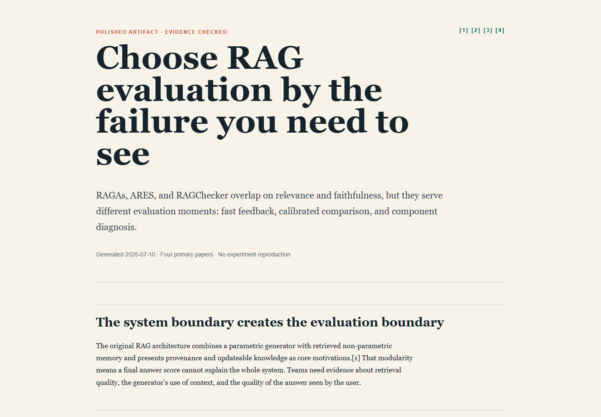

# Classic STORM example: RAG evaluation frameworks

## Prompt

```text
Use the storm skill to research RAG evaluation frameworks. Produce the standard HTML artifact bundle and focus on how an engineering team should choose among RAGAs, ARES, and RAGChecker.
```



## Artifact progression

| Stage | Artifact | What changes |
|---|---|---|
| Direct outline | [direct_gen_outline.html](https://lizhouai.github.io/storm/examples/classic-rag-evaluation/direct_gen_outline.html) | Topic-only structure before retrieval |
| Refined outline | [storm_gen_outline.html](https://lizhouai.github.io/storm/examples/classic-rag-evaluation/storm_gen_outline.html) | Adds dimensions and framework distinctions found in the papers |
| Draft article | [storm_gen_article.html](https://lizhouai.github.io/storm/examples/classic-rag-evaluation/storm_gen_article.html) | Writes the evidence-backed comparison with inline citations |
| Polished article | [storm_gen_article_polished.html](https://lizhouai.github.io/storm/examples/classic-rag-evaluation/storm_gen_article_polished.html) | Tightens the decision guidance and adds verification notes |

## Research trace

| Perspective | Question theme | Query theme | Primary sources used |
|---|---|---|---:|
| Basic fact writer | Why RAG needs modular evaluation | Original RAG architecture and provenance | 1 |
| Evaluation methodologist | Which dimensions can be evaluated automatically | RAGAs and ARES evaluation dimensions | 2 |
| Systems diagnostician | How to localize retrieval versus generation failures | RAGChecker diagnostic metrics | 1 |
| Engineering lead | How the frameworks differ operationally | Cross-source synthesis | 3 |

## Source boundary

The example uses four primary papers:

1. Lewis et al., [Retrieval-Augmented Generation for Knowledge-Intensive NLP Tasks](https://papers.neurips.cc/paper/2020/hash/6b493230205f780e1bc26945df7481e5-Abstract.html), NeurIPS 2020.
2. Es et al., [RAGAs: Automated Evaluation of Retrieval Augmented Generation](https://aclanthology.org/2024.eacl-demo.16/), EACL 2024 System Demonstrations.
3. Saad-Falcon et al., [ARES: An Automated Evaluation Framework for Retrieval-Augmented Generation Systems](https://aclanthology.org/2024.naacl-long.20/), NAACL 2024.
4. Ru et al., [RAGChecker: A Fine-grained Framework for Diagnosing Retrieval-Augmented Generation](https://proceedings.neurips.cc/paper_files/paper/2024/hash/27245589131d17368cccdfa990cbf16e-Abstract-Datasets_and_Benchmarks_Track.html), NeurIPS 2024 Datasets and Benchmarks Track.

## Limits

- The example compares the frameworks from their published method descriptions; it does not reproduce their experiments.
- Cost, latency, judge-model sensitivity, and behavior of later software releases are outside the source boundary.
- The framework-selection guidance in the polished article is an inference from the stated methods, not a benchmark ranking.
